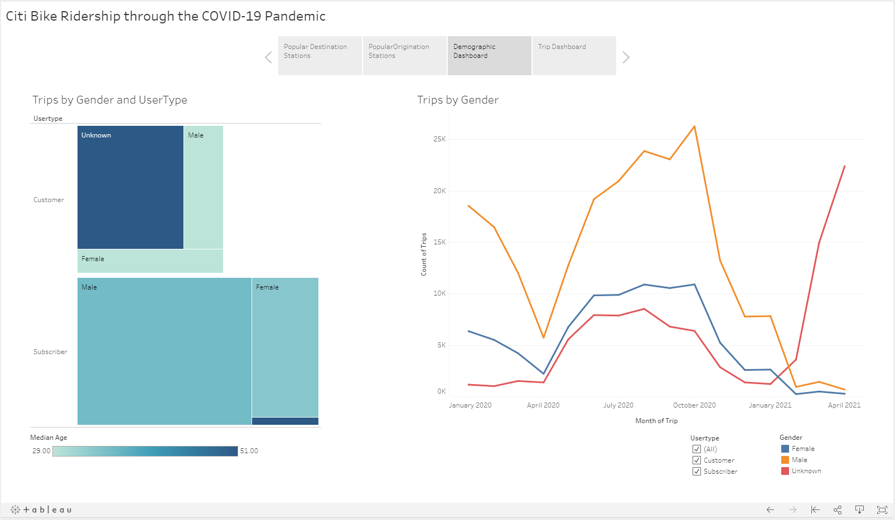

# Citi Bike Ridership through the COVID-19 Pandemic
This project is a Tableau Story comprised of dashboards, maps, and visualizations that describe ridership, trips, and stations during the COVID-19 pandemic. Data was gathered from the Citi Bike Data portal for each month from January 2020 through April 2021 and unioned in Tableau.

## Features

The Story contains four dashboards: 

1. Popular Destination Stations

2. Popular Origination Stations

3. Demographic Dashboard

4. Trip Dashboard

## Findings

- Overall, most riders use the bikes in Jersey City 
- Grove St PATH is the most popular starting and ending station
- Users vary by age with most users being under 60
- Users that purchase the 24 hour or 3 day pass are less likely to enter accurate demographic information 
- Men in their 30s are more likely to subscribe to the service than any other market segment
- Subscribers are most likely using the bikes during their commutes. The most popular times of day for subscribers are 8 am and between 5 and 6 pm
- The number of total trips fell significantly in Fall of 2020 beginning in early to mid October
- Subscribers were the most common users of the bikes until late January
- Since Februray of 2021 as vaccines are becoming more readily available, use and ridership have begun to increase
- As of April 25, 2021 subscribers made up only 1% of trips

## Deployment

## Status
_finished_

## Inspritation
This project was assigned as part of the UTSA Data Analytics Bootcamp.